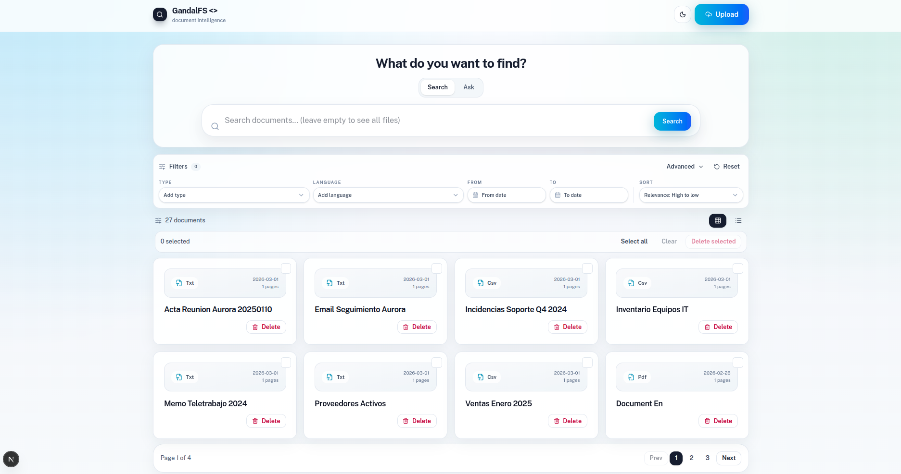
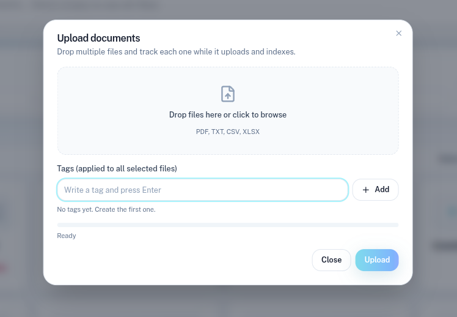
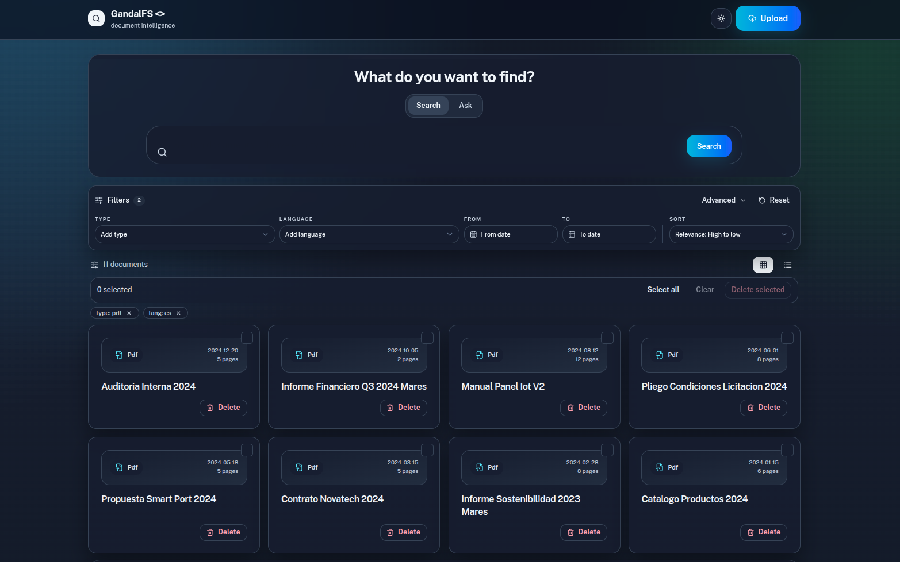
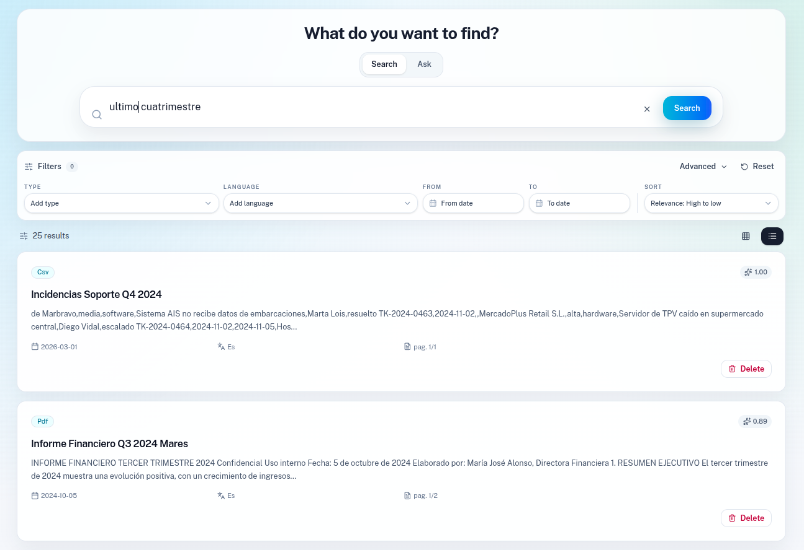
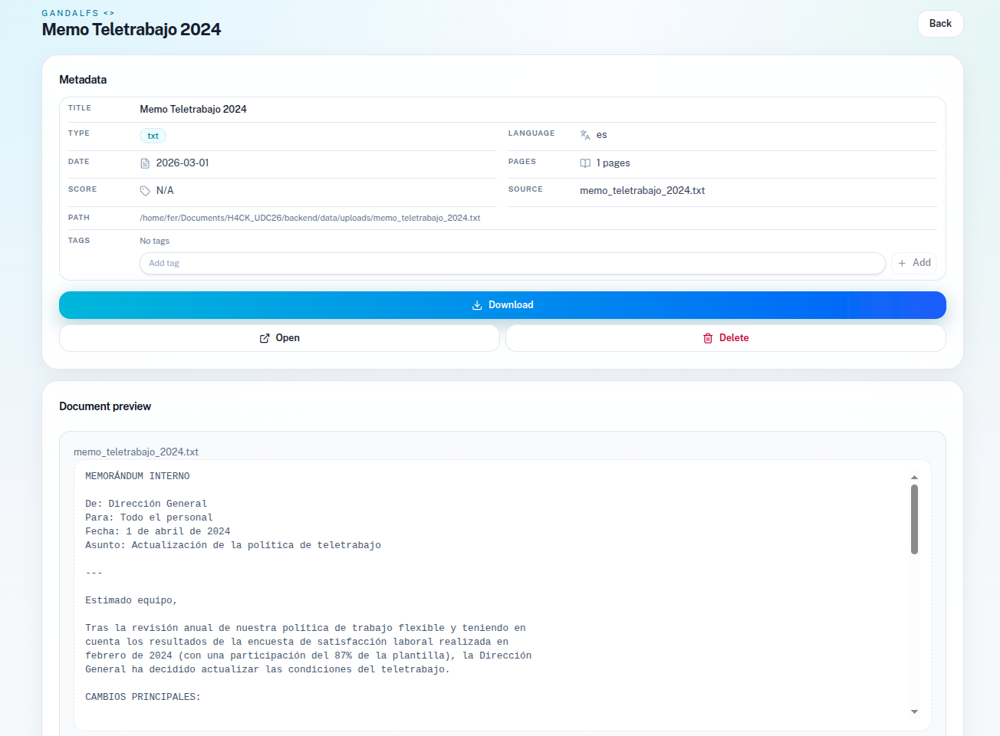
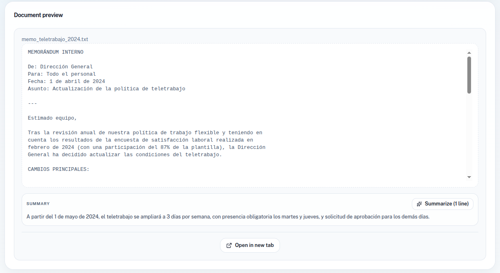
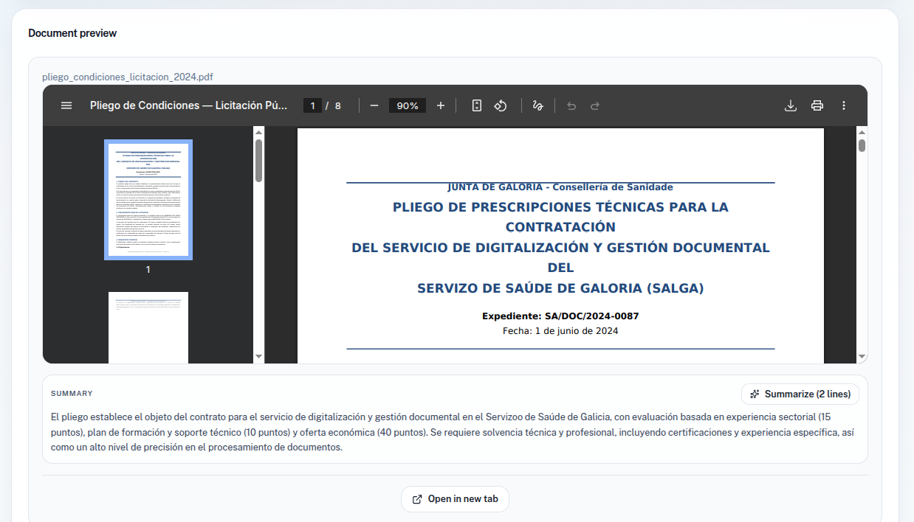
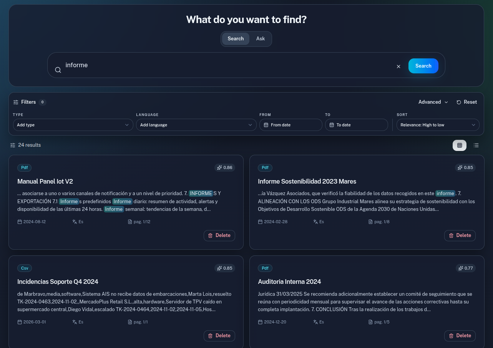
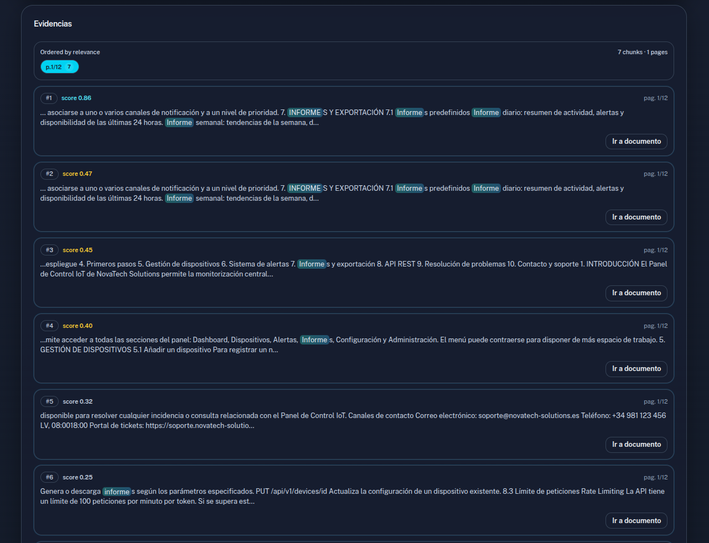
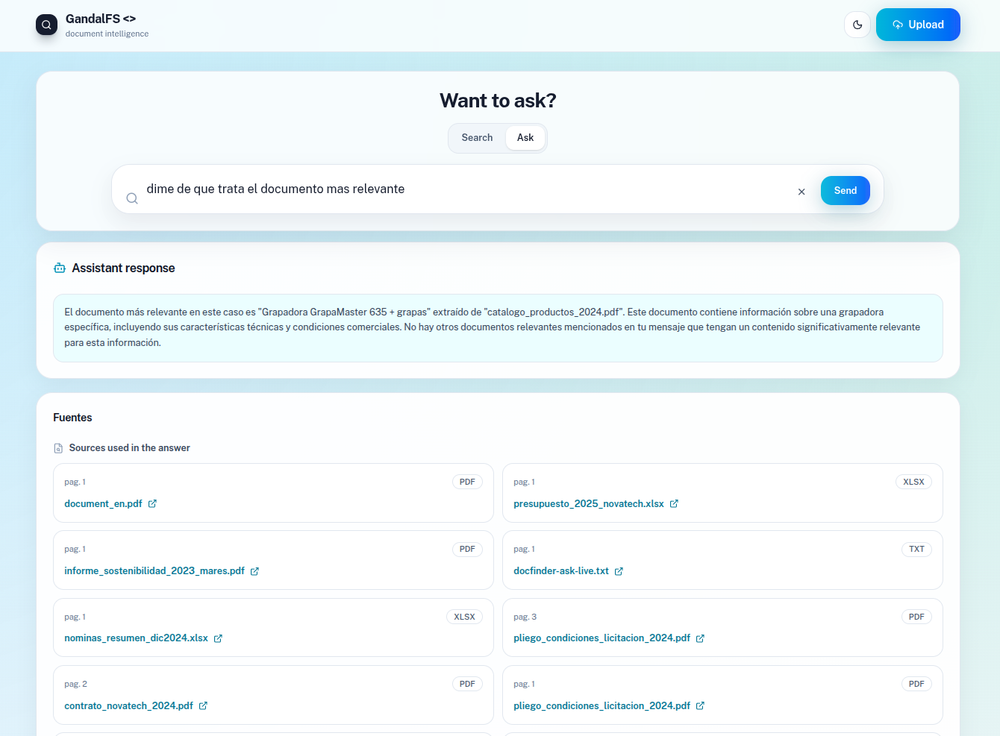

# 🧙‍♂️ GandalFS

> **G**reat **A**nother **N**on-trivial **D**ynamic **A**mazing **L**ayered **F**ile **S**earcher

**GandalFS** no es solo un buscador; es el guardián de la sabiduría de tu empresa. Es un sistema **RAG (Retrieval-Augmented Generation)** de alto rendimiento diseñado para indexar, buscar y comprender archivos corporativos (PDF, XLSX, CSV, TXT) mediante una arquitectura híbrida que combina lo mejor de la búsqueda clásica y la inteligencia artificial semántica.

---

## ✨ Funcionalidades Mágicas

- **Búsquedas de Élite**: Indexar y buscar archivos con gran velocidad y sencillez, logrando resultados precisos de forma inmediata.
- **Interfaz Reactiva**: Visualizar tus documentos de forma atractiva, con una interfaz veloz que responde en tiempo real a tus interacciones.
- **Gestión de Conocimiento**: Organizar tus documentos, filtrar resultados, crear tags personalizados y etiquetar tus archivos según las necesidades de tu entorno.
- **Asistente de IA**: Un compañero que no solo potencia las búsquedas, sino que resuelve dudas sobre tus archivos y recomienda documentos similares para hacer tus datos más significativos.

---

## 🏗️ Arquitectura: El Concilio de los Módulos

Nuestro proyecto no ha sido concebido como una arquit.El objetivo es dotar al usuario final de flexibilidad y control absoluto sobre la aplicación.

### 🧩 Flexibilidad y Extensibilidad (Addons)
GandalFS está diseñado bajo el principio de **responsabilidad única**. Esto permite una evolución constante del sistema:
* **Nuevos Formatos**: Añadir compatibilidad con nuevos tipos de archivos (como `.docx`, `.pptx` o `.html`) es tan fácil como integrar un nuevo módulo de procesamiento.
* **Campos Personalizados**: La arquitectura permite añadir campos de metadatos personalizados al buscador para adaptarse a múltiples entornos empresariales.
* **Modelos Intercambiables**: Gracias a la separación clara entre Front y Back (vía FastAPI), es sencillo sustituir o añadir nuevos modelos de lenguaje o motores de embedding.

---

## 🚀 Características Principales

* **Búsqueda Híbrida de 3 Vías (RRF)**: Implementamos *Reciprocal Rank Fusion* (RRF) combinando:
    1.  **Match Simple**: Búsqueda por palabras clave tradicionales.
    2.  **Frase Exacta**: Para encontrar términos técnicos o nombres específicos.
    3.  **K-NN Semántico**: Entendimiento contextual profundo mediante embeddings.
* **Procesamiento Inteligente de Documentos**: Limpieza automática de ruido en PDFs (headers, footers y artefactos de OCR) para que la IA se centre solo en el contenido relevante.
* **IA "On-Premise" con Ollama**: Consultas inteligentes sobre tus documentos sin que los datos salgan de tu infraestructura, garantizando la máxima privacidad empresarial.
* **Optimización de RI (Retrieval Information)**:
    * **Normalización Min-Max**: Para homogeneizar las puntuaciones de diferentes métodos de búsqueda[cite: 1, 2].
    * **Chunking Robusto**: Segmentación por frases para texto continuo o fallback a palabras para documentos con OCR deficiente.
    * **Prefijos de Modelo E5**: Segmentación con solapamiento (overlap) para localizaciones precisas de segmentos de información.

---

## 🛠️ Stack Tecnológico

| Componente | Tecnología |
| :--- | :--- |
| **Motor de Búsqueda** | **OpenSearch** (con soporte k-NN y Faiss) |
| **Orquestador AI** | **Ollama** (Modelo Qwen 2.5 7B)|
| **Embeddings** | **Sentence-Transformers** (Multilingual E5 Small)|
| **Backend API** | **FastAPI**|
| **Procesamiento** | **PyMuPDF (fitz)**, **PyPDF2**, **Tesseract (OCR)** |
| **Lógica de Datos** | **Pandas**, **Openpyxl**


## 🔧 Instalación y Configuración

### Requisitos
* **Docker** (para OpenSearch) []
* **Ollama** (modelos `qwen2.5:7b-instruct` e `intfloat/multilingual-e5-small`) 
* **Python 3.10+** 
* **Tesseract OCR** 

### Paso a paso
1.  **Levantar el motor de búsqueda**:
    ```bash
    docker compose -f backend/docker-compose.yml -d
    ```
2.  **Instalar dependencias**:
    ```bash
    pip install -r requirements.txt
    ```
3.  **Inicializar el sistema**:
    ```bash
    python3 -m uvicorn endpoint:app --reload
    ```
4.  **Iniciar la GUI**
    ```bash
    npm install 
    npm run dev
    ```

---

## 🧙‍♂️ Uso de la CLI y GUI

GandalFS ofrece versatilidad total en su interacción:

### Interfaz de Comandos (CLI)
* **Iniciar el índice**: `python cli.py init`
* **Indexar un documento**: `python cli.py index`
* **Búsqueda técnica**: `python cli.py search`
* **Preguntar a la IA**: `python cli.py ask_ai`

### Interfaz Web (GUI)
La aplicación cuenta con una **interfaz web dedicada**, diseñada para ser el centro de operaciones donde gestionar tus archivos de forma visual y reactiva.












---

## 🛡️ Licencia
Este proyecto es software libre, distribuido bajo la **GNU General Public License v3**. Consulta el archivo `LICENSE` para más detalles.

---

> *"Un buscador no llega tarde, ni pronto, llega exactamente cuando se le necesita."*
